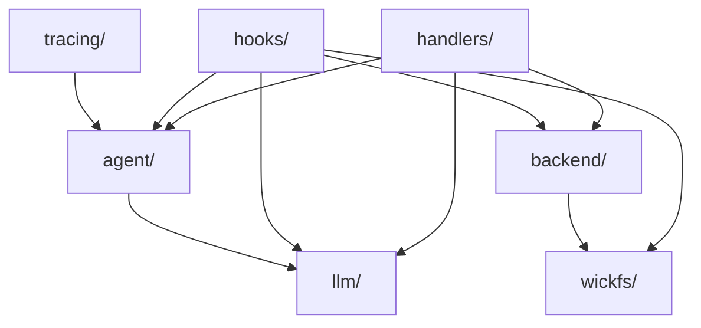

# wick_deep_agent/server — Interface Architecture

## Package Dependency Graph



## Interface & Implementation Diagram (UML Class Diagram)

```mermaid
classDiagram
    direction TB

    %% ─── wickfs package ───
    namespace wickfs {
        class FileSystem {
            <<interface>>
            +Ls(ctx, path) []DirEntry, error
            +ReadFile(ctx, path) string, error
            +WriteFile(ctx, path, content) *WriteResult, error
            +EditFile(ctx, path, old, new) *EditResult, error
            +Grep(ctx, pattern, path) *GrepResult, error
            +Glob(ctx, pattern, path) *GlobResult, error
            +Exec(ctx, command) *ExecResult, error
        }
        class Executor {
            <<interface>>
            +Run(ctx, command) string, int, error
            +RunWithStdin(ctx, command, stdin) string, int, error
        }
        class LocalFS {
            -rootDir string
        }
        class RemoteFS {
            -exec Executor
        }
    }

    FileSystem <|.. LocalFS : implements
    FileSystem <|.. RemoteFS : implements
    RemoteFS --> Executor : uses

    %% ─── agent package ───
    namespace agent {
        class Tool {
            <<interface>>
            +Name() string
            +Description() string
            +Parameters() map
            +Execute(ctx, args) string, error
        }
        class Hook {
            <<interface>>
            +Name() string
            +Phases() []string
            +BeforeAgent(ctx, state) error
            +WrapModelCall(ctx, msgs, next) *Response, error
            +AfterModel(ctx, state, toolCalls) map, error
            +WrapToolCall(ctx, call, next) *ToolResult, error
            +ModifyRequest(ctx, prompt, msgs) string, []Message, error
        }
        class BaseHook {
            <<abstract>>
            no-op defaults
        }
        class FuncTool {
            -Fn func
        }
        class HTTPTool {
            -URL string
        }
        class TraceRecorder {
            <<interface>>
            +StartSpan(name) SpanHandle
            +RecordEvent(name, metadata)
        }
        class SpanHandle {
            <<interface>>
            +Set(key, value) SpanHandle
            +End()
        }
        class Agent_struct["Agent"] {
            -LLM llm.Client
            -Tools []Tool
            -Hooks []Hook
            +Run(ctx, state) error
            +RunStream(ctx, state) chan StreamEvent
        }
        class ToolRegistry {
            -tools map~string,Tool~
        }
    }

    Tool <|.. FuncTool : implements
    Tool <|.. HTTPTool : implements
    Hook <|.. BaseHook : default impl
    Agent_struct --> Tool : has many
    Agent_struct --> Hook : has many
    ToolRegistry --> Tool : stores

    %% ─── llm package ───
    namespace llm {
        class Client {
            <<interface>>
            +Call(ctx, req) *Response, error
            +Stream(ctx, req, ch) error
            +BuildRequestJSON(req) json.RawMessage
        }
        class OpenAIClient
        class AnthropicClient
        class HTTPProxyClient
    }

    Client <|.. OpenAIClient : implements
    Client <|.. AnthropicClient : implements
    Client <|.. HTTPProxyClient : implements
    Agent_struct --> Client : uses

    %% ─── backend package ───
    namespace backend {
        class Backend {
            <<interface>>
            +ID() string
            +Execute(command) ExecuteResponse
            +ExecuteWithStdin(command, stdin) ExecuteResponse
            +UploadFiles(files) []FileUploadResponse
            +DownloadFiles(paths) []FileDownloadResponse
            +ContainerStatus() string
            +ContainerError() string
            +Workdir() string
            +ResolvePath(path) string, error
            +TerminalCmd() []string
            +FS() wickfs.FileSystem
        }
        class ContainerManager {
            <<interface>>
            +CancelLaunch()
            +StopContainer()
            +ContainerName() string
        }
        class LocalBackend
        class DockerBackend
        class DockerExecutor
    }

    Backend <|.. LocalBackend : implements
    Backend <|.. DockerBackend : implements
    ContainerManager <|.. DockerBackend : implements
    Executor <|.. DockerExecutor : implements
    Backend --> FileSystem : returns via FS()

    %% ─── hooks package ───
    namespace hooks {
        class FilesystemHook {
            -backend Backend
            -fs FileSystem
        }
        class MemoryHook {
            -backend Backend
        }
        class SkillsHook {
            -backend Backend
        }
        class SummarizationHook {
            -llmClient llm.Client
        }
        class TodoListHook
    }

    BaseHook <|-- FilesystemHook : embeds
    BaseHook <|-- MemoryHook : embeds
    BaseHook <|-- SkillsHook : embeds
    BaseHook <|-- SummarizationHook : embeds
    BaseHook <|-- TodoListHook : embeds
    FilesystemHook --> Backend : depends on
    FilesystemHook --> FileSystem : depends on
    MemoryHook --> Backend : depends on
    SkillsHook --> Backend : depends on
    SummarizationHook --> Client : depends on

    %% ─── tracing package ───
    namespace tracing {
        class Trace
        class SpanRecorder
        class TracingHook
    }

    TraceRecorder <|.. Trace : implements
    SpanHandle <|.. SpanRecorder : implements
    BaseHook <|-- TracingHook : embeds
    TracingHook --> TraceRecorder : uses

    %% ─── handlers package ───
    namespace handlers {
        class ToolStore {
            +AddTool(Tool)
            +All() []Tool
        }
        class EventBus {
            +Send(StreamEvent)
        }
        class BackendStore {
            +Get(user) Backend
            +Stop(user)
        }
    }

    ToolStore --> Tool : manages
    BackendStore --> Backend : manages
```



## Agent Loop — Hook Onion Ring (Sequence)

```mermaid
sequenceDiagram
    participant Loop as Agent Loop
    participant H as Hooks[]
    participant LLM as llm.Client
    participant T as Tools[]

    Loop->>H: BeforeAgent(state)
    loop max 25 iterations
        Loop->>H: ModifyRequest(prompt, msgs)
        H-->>Loop: modified prompt, msgs
        Loop->>H: WrapModelCall(msgs, next)
        H->>LLM: Call/Stream(request)
        LLM-->>H: Response (text + tool_calls)
        H-->>Loop: Response
        alt has tool_calls
            Loop->>H: AfterModel(state, toolCalls)
            H-->>Loop: short-circuit results (optional)
            loop each tool_call
                Loop->>H: WrapToolCall(call, next)
                H->>T: Execute(args)
                T-->>H: result
                H-->>Loop: ToolResult
            end
        else no tool_calls
            Loop-->>Loop: break (done)
        end
    end
```

## Interface Summary

| Interface | Package | Methods | Implementors |
|-----------|---------|---------|--------------|
| `FileSystem` | wickfs | 7 | LocalFS, RemoteFS |
| `Executor` | wickfs | 2 | DockerExecutor |
| `Tool` | agent | 4 | FuncTool, HTTPTool |
| `Hook` | agent | 5+2 | 6 hooks via BaseHook |
| `Client` | llm | 3 | OpenAI, Anthropic, HTTPProxy |
| `Backend` | backend | 10 | LocalBackend, DockerBackend |
| `ContainerManager` | backend | 3 | DockerBackend |
| `TraceRecorder` | agent | 2 | Trace |
| `SpanHandle` | agent | 2 | SpanRecorder |

## Key Design Patterns

1. **Strategy Pattern** — `llm.Client`, `backend.Backend`, `wickfs.FileSystem` allow swapping implementations at runtime
2. **Decorator/Middleware (Onion Ring)** — `Hook` interface wraps model and tool calls in composable layers
3. **Abstract Factory** — `llm.Resolve()` picks the right Client implementation from config
4. **Adapter** — `DockerExecutor` adapts Docker commands into `wickfs.Executor` interface for `RemoteFS`
5. **Registry** — `ToolRegistry`, `agent.Registry`, `ToolStore` provide named lookups for tools and agent instances
6. **Null Object** — `BaseHook` provides no-op defaults so hooks only override phases they care about
